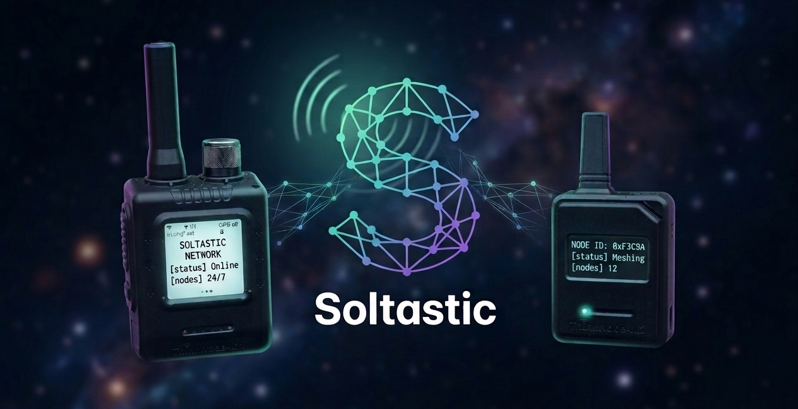

<div align="center">



# Soltastic
**Solana transactions when mobile internet down.**

[](#)
[](#license)
[](#why-solana)
[](#)

</div>

The project contains two parts:

- **Client** - a local browser application, a bridge between the wallet and the Meshtastic BLE node.
- **Server** - A relay server application that listens on the Meshtastic channel and communicates with Solana RPC nodes for client requests.

> Current prototype: Client initiates transaction; Server verifies balances and sends Durable Nonce to Client; Client creates and signs transaction; Server transmits to Solana network via RPC node.

---

## Problem

Solana transactions typically require an active internet connection at the time of signing and sending. In remote areas, disaster zones, field operations, mobile operator outages, festivals, or censorship-resistant environments, users may have a phone and a local radio network, but no internet access.

This creates a "last mile" problem:

- the user can create or confirm the transaction locally;
- the user cannot reliably communicate with the Solana RPC endpoint;
- an internet-connected relayer must assist in sending the signed transaction without taking over the management of the funds.

---

## Solution

**Soltastic** uses **Meshtastic** as the offline/low-connectivity transport layer and **Solana Durable Nonces** as the transaction freshness layer.

The high-level flow:

1. The client connects to the Meshtastic BLE node.
2. The client broadcasts an initialization message.
3. The server receives the initialization message, creates a Durable Nonce with the permissions assigned to the client's wallet, and sends a response to the client via Meshtastic.
4. The client prepares the transaction, signs it, and sends the metadata and signature.
5. The server receives the metadata and signature, recreates the transaction, and sends it to the Solana RPC node.


The server never receives the user's private key!

---

## Why Solana

**Soltastic** was created for Solana because the network's properties support Deferred Execution based on Durable Nonces:

- **no expiration** — Deferred Execution do not require Blockhash, allowing transactions to exist for more than 2 minutes (150 blocks).
- **no double-spending** — an account's Advanced Nonce value changes after use, preventing double-spending.
- **mobile and wallet ecosystem** — Solana wallets can sign transactions on the client side without revealing private keys to a relayer and not delegating assets.

---

## Demo

Add demo assets before hackathon submission:

- **Live demo:** `https://<your-github-pages-or-demo-url>`
- **Video walkthrough:** `https://<your-video-url>`
- **Screenshots:** put images in `assets/` and reference them below.

Example:

```md


```

---

## Architecture

```text
┌──────────────────────────┐
│ Soltastic Client          │
│ Browser + Wallet + BLE    │
└─────────────┬────────────┘
              │ Meshtastic slot 7
              │ ST,init,<wallet>
              ▼
┌──────────────────────────┐
│ Meshtastic LoRa Mesh      │
│ Offline last-mile network │
└─────────────┬────────────┘
              │
              ▼
┌──────────────────────────┐
│ Soltastic Server / M-node │
│ BLE + Fastify + Solana RPC│
└─────────────┬────────────┘
              │
              ▼
┌──────────────────────────┐
│ Solana RPC / Devnet       │
│ Balances + Durable Nonce  │
└──────────────────────────┘
```

### Server responsibilities

- Connect to a Meshtastic BLE node.
- Receive init messages (Meshtastic).
- Query Solana balances (Internet).
- Create durable nonce accounts with autorithy for clien's wallet address (Internet).
- Reply into the mesh channel and send nonce account info for client (Meshtastic).
- Receive metadata with the signature (Meshtastic).
- Recreate and check transaction.
- Send transaction to RPC Node Solana (Internet).
- Send status to client (Meshtastic).

### Client responsibilities

- Connect to a Solana wallet.
- Connect to a Meshtastic BLE node.
- Send init messages to the mesh channel (Meshtastic).
- Receive server replies Durable Nonce account (Meshtastic).
- Transaction preparation, signing, and sending metadata with the signature (Meshtastic).
- Receive status transaction (Meshtastic).

---

## Protocol

### Init request

```text
ST,init,<wallet_address>
```

Example:

```text
ST,init,BX64tYBofmJM6PTWXtHjA8p8ij5dnzsqLXbgddaVmkom
```

### Successful response

```text
ST,S=<balance_sol>,C=<balance_usdc>,a=<nonce_account>,v=<nonce_value>
```

Fields:

| Field | Meaning |
|---|---|
| `S` | SOL balance |
| `C` | USDC balance |
| `a` | durable nonce account address |
| `v` | durable nonce value |

### Low SOL response

```text
ST,S=<balance_sol>,C=<balance_usdc>,e=1
```

### Error response

```text
ST,S=0,C=0,e=2
```


## Repository Structure

Recommended clean structure:

```text
soltastic/
├── README.md
├── LICENSE
├── CONTRIBUTING.md
├── assets/
│   ├── logo.png
│   ├── client-screenshot.png
│   └── server-screenshot.png
├── docs/
│   ├── architecture.md
│   ├── product.md
│   └── roadmap.md
├── client/
│   ├── index.html
│   ├── app.js
│   ├── style.css
│   ├── meshtastic-wb.js
│   └── package.json
└── server/
    ├── server/
    │   └── index.ts
    ├── index.html
    ├── app.js
    ├── style.css
    ├── package.json
    └── keys/
        └── server-payer.json.example
```


## Quick Start

### 1. Install dependencies

```bash
npm install
nvm use 22
```

### 2. Create server payer keypair

```bash
mkdir -p keys
solana-keygen new --outfile keys/server-payer.json
```

For devnet testing:

```bash
solana config set --url devnet
solana airdrop 2 $(solana-keygen pubkey keys/server-payer.json)
```

or transfer some SOL on the testnet to this address:

```bash
solana-keygen pubkey keys/server-payer.json
```

Check balance:

```bash
solana balance $(solana-keygen pubkey keys/server-payer.json)
```

### 3. Configure environment

Create `.env`:

```env
PORT=8787
SOLANA_RPC_URL=https://api.devnet.solana.com

# relative path to server keys
SERVER_KEYPAIR=keys/server-payer.json

# minimum client balance
MIN_SOL=0.002

# USDS smart contract address on the testnet
USDC_MINT=4zMMC9srt5Ri5X14GAgXhaHii3GnPAEERYPJgZJDncDU

# client response time
NONCE_COOLDOWN_SECONDS=3600
```

### 4. Run server + browser UI

```bash
npm run dev
```

The app opens at:

```text
http://localhost:5173/
```

Use `localhost` for Web Bluetooth support.

---

Never commit real keypairs.

---


## Development Commands

```bash
npm run dev      # run backend + Vite UI
npm audit --omit=dev
```

Known dependency note: Solana JS SDK v1 may currently produce moderate `npm audit` warnings through transitive dependencies. Do not run `npm audit fix --force` blindly because it can install incompatible old Solana packages.

---

## Roadmap

- [x] Meshtastic BLE connection
- [x] Monitor Meshtastic channel slot `7`
- [x] Parse `ST,init,<wallet>` messages
- [x] Check SOL and USDC balances
- [x] Create durable nonce account
- [x] Reply with nonce account and nonce value
- [ ] Client-side durable nonce transaction builder
- [ ] Signed transaction transfer over Meshtastic
- [ ] Server-side signed transaction submission to Solana RPC
- [ ] Server payment distribution design
- [ ] Demo video / GIF
- [ ] Docs: architecture, API, product, roadmap

---

## GitHub Topics

Recommended repository topics:

```text
solana
meshtastic
lora
web3
durable-nonce
offline-payments
hackathon
colosseum
superteam
```

---

## Contributing

Contributions are welcome. Suggested flow:

1. Fork the repository.
2. Create a feature branch:

   ```bash
   git checkout -b feat/my-feature
   ```

3. Commit with a meaningful message:

   ```bash
   git commit -m "feat: add signed init verification"
   ```

4. Open a pull request.

Please avoid committing real private keys, `.json` and `.env` files, generated build artifacts, or temporary files.

---

## License

Apache 2.0 License. See `LICENSE`.

---

## Links

- Solana docs: https://solana.com/docs
- Meshtastic docs: https://meshtastic.org/docs
- Project demo: `TODO`
- Pitch deck: `TODO`
- Video walkthrough: `TODO`
