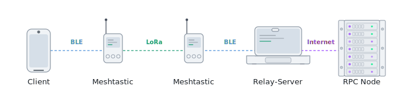

<div align="center">


# Soltastic
**Solana transactions when mobile internet down.**

[](#Docs)
[](#License)
[](#why-solana)
[](#Docs)

</div>

---

## Problem

**Mobile connectivity failures create direct financial losses.**
When internet access fails, users lose the ability to move value, accept payments, execute transactions, or react to urgent financial events.

Sky Business research shows that UK SMEs affected by running out of mobile data lose over **£3,400 per year on average** in missed revenue, with **56%** of affected businesses reporting lost sales, bookings, or opportunities. [Sky Group](https://skygroup.sky/article/fear-of-running-out-of-mobile-data-foro-is-a-real-issue-for-uk-businesses-as-companies-lose-over-3-400-a-year)

In remote areas, disaster zones, fieldwork, crowded festivals, network outages, or censorship-resistant environments, this problem becomes even more important. A user may still have a wallet and a signed Solana transaction, but no internet connection to broadcast it.


---

## Solution

Soltastic is not just another wallet feature — it is a decentralized last-mile communication layer for blockchain transactions.
Using local LoRa-based mesh networks as the last mile, a relay server for transmitting RPC nodes to Solana, and deferred transaction technology.

[World Map](https://meshmap.net/)

---

## Why Solana

**Soltastic** was created for Solana because the network's properties support Deferred Execution based on **Durable Nonces**:

- **no expiration** — Deferred Execution do not require Blockhash, allowing transactions to exist for more than 2 minutes (150 blocks).
- **no double-spending** — an account's Advanced Nonce value changes after use, preventing double-spending.
- **mobile and wallet ecosystem** — Solana wallets can sign transactions on the client side without revealing private keys to a relayer and not delegating assets.

---

## Demo

Add demo assets before hackathon submission:

- **Live demo:** `https://<your-github-pages-or-demo-url>`
- **Video walkthrough:** `https://<your-video-url>`
- **Screenshots:** put images in `assets/` and reference them below.

Example:

```md


```

---

## Docs

[Architecture](docs/architecture.md)

[Protocol](docs/ptotocol.md)

[Setup-n-Run](docs/setup-n-run.md)

[Security](docs/security.md) 

The project contains two parts:

- **Client** - a local browser application or mobile version, a bridge between the wallet and the Meshtastic BLE node.
- **Server** - A relay server application that listens on the Meshtastic channel and communicates with Solana RPC nodes for client requests.



| # | From | Message | To | Protocol |
|---|------|---------|----|----------|
| 1 | Client | `init` | Server | 🟢 LoRa |
| 2 | Server | `get balances` and create `Durable Nonce` | RPC Node | 🟣 Internet |
| 3 | RPC Node | Return `balances` and `Durable Nonce` Value | Server| 🟣 Internet |
| 4 | Server | Return `balances` and `Durable Nonce` Value | Client | 🟢 LoRa |
| 5 | Clent | `meta-data` and `signature` | Server | 🟢 LoRa |
| 6 | Server | `transaction` | RPC Node | 🟣 Internet |
| 7 | RPC Node | `tx hash` | Server | 🟣 Internet |
| 8| Server |  `tx hash` | Client | 🟢 LoRa |

> [!IMPORTANT]
> **Privacy First:** The server never receives the user's private key. All signing happens locally on the client device.


---

## Roadmap

- [x] Basic version (init request, get balance, create SOL transaction, send metadata + signatures, recreate transaction, send to RPC, confirm tx hash to client).
- [ ] Connecting Meshtastic nodes via serial and WiFi.
- [ ] Support other tokens.
- [ ] Support Memos.
- [ ] Support other transaction types (calling smart contracts).
- [ ] Smart Contract for Server Reward Distribution.

---

## Contributing

Contributions are welcome. Suggested flow:

1. Fork the repository.
2. Create a feature branch:

   ```bash
   git checkout -b feat/my-feature
   ```

3. Commit with a meaningful message:

   ```bash
   git commit -m "feat: add signed init verification"
   ```

4. Open a pull request.

Please avoid committing real private keys, `.json` and `.env` files, generated build artifacts, or temporary files.

## License

Apache-2.0