# Soltastic Architecture

**Soltastic is an offline last-mile transaction relay for Solana.**

It allows a user to sign a Solana transaction locally and send transaction data through a Meshtastic / LoRa mesh network to an internet-connected gateway. The gateway submits the transaction to Solana RPC and returns the confirmed transaction signature back to the user over the mesh.

Soltastic does not create a new blockchain, token, validator set, mining network, or offline consensus layer.

> Meshtastic is the transport. Solana is the settlement layer.

---

## High-level architecture



---

## Core idea

The user may be offline, but still has:

- a wallet;
- funds;
- a transaction intent;
- a nearby Meshtastic node.

The missing piece is a path to Solana RPC.

Soltastic provides that path through a Mesh Gateway: an internet-connected relay that receives transaction data over Meshtastic and broadcasts it to Solana.

---

## Main components

### 1. Client

The Soltastic client is the user-facing application.

There are currently two prototype clients:

| Client | Purpose |
|---|---|
| Local Web Client | Browser-based version for development, debugging, and demos |
| Android Client | Smartphone prototype for mobile field-style testing |

The client is responsible for:

- connecting to a Solana wallet;
- connecting to a Meshtastic node;
- sending init requests over the mesh;
- receiving balance and Durable Nonce data;
- building the transaction locally;
- requesting local wallet signing;
- sending signed transaction data over Meshtastic;
- displaying gateway status and confirmed transaction signature.

The client never sends the user's private key to the gateway.

---

### 2. User wallet

The wallet signs the transaction locally.

The wallet is responsible for:

- holding the user's private key;
- displaying the transaction request to the user;
- signing only after user approval.

The wallet does not need to know about Meshtastic or LoRa.

From the wallet's point of view, Soltastic is a transaction builder and relay helper.

---

### 3. Meshtastic node

The client-side Meshtastic node is the user's radio transport.

It is responsible for:

- sending Soltastic messages into the mesh;
- receiving gateway responses;
- using LoRa for local communication where internet may be unavailable.

The Meshtastic node does not understand Solana transactions. It only transports payloads.

---

### 4. Mesh Gateway

The Mesh Gateway is the bridge between the radio network and the internet.

It has:

- a Meshtastic node;
- internet access;
- a running Soltastic Gateway Server;
- access to Solana RPC.

The Mesh Gateway is responsible for:

- listening for Soltastic messages;
- replying to the original mesh sender;
- creating or preparing Durable Nonce state;
- checking SOL and token balances;
- reconstructing the expected transaction;
- verifying the user's signature;
- submitting the transaction to Solana RPC;
- waiting for confirmation;
- returning the final transaction signature.

The gateway is not a custodian.

It cannot spend user funds unless the user has signed the exact transaction.

---

### 5. Solana RPC

Solana RPC is the gateway's path to the Solana network.

The gateway uses RPC to:

- check balances;
- create or manage Durable Nonce accounts;
- simulate or submit transactions;
- wait for confirmation;
- retrieve transaction status.

Solana remains the only source of settlement finality.

---

## Data flow

### Phase 1: Session initialization

```text
Client
  │
  │ ST,init,<wallet>
  ▼
Meshtastic mesh
  │
  ▼
Gateway
  │
  │ check wallet balances
  │ prepare Durable Nonce
  │ store mesh sender ↔ wallet session
  │
  │ ST,S=<sol>,C=<usdc>,a=<nonce_account>,v=<nonce_value>,p=<fee_address>
  ▼
Client
```

Purpose:

- identify the wallet;
- bind the mesh sender to the wallet session;
- prepare transaction data;
- return balances and Durable Nonce information to the client.

---

### Phase 2: Local transaction building

```text
Client receives:
  - wallet address
  - receiver address
  - token
  - amount
  - nonce account
  - nonce value
  - gateway fee address

Client builds:
  - nonceAdvance instruction
  - user transfer instruction
  - gateway fee instruction
  - optional compute budget instructions

Wallet signs locally.
```

The gateway does not receive a private key.

---

### Phase 3: Mesh relay

```text
Client
  │
  │ signed transaction data / metadata
  ▼
Meshtastic mesh
  │
  ▼
Gateway
```

The current prototype uses compact text messages.

The planned production direction is compact binary payloads over a private Meshtastic application port.

Details are described in:

```text
docs/protocol.md
```

---

### Phase 4: Gateway verification and submission

```text
Gateway
  │
  │ load session
  │ reconstruct expected transaction
  │ verify wallet signature
  │ submit transaction to Solana RPC
  │ wait for confirmation
  ▼
Solana
```

The gateway must reject the transaction if:

- there is no known session;
- nonce data is missing or stale;
- the signature does not match the reconstructed transaction;
- transaction simulation or submission fails;
- Solana confirmation times out;
- the transaction fails on-chain.

---

### Phase 5: Result response

```text
Gateway
  │
  │ ST,<tx_hash>
  ▼
Meshtastic mesh
  │
  ▼
Client
```

The client displays the confirmed transaction signature.

The user should see a clear distinction between:

- message sent over mesh;
- message received by gateway;
- transaction submitted to RPC;
- transaction confirmed on Solana.

Only Solana confirmation is final success.

---

## Trust boundaries

Soltastic has several trust boundaries.

```text
┌──────────────────────────────┐
│ User trust zone              │
│                              │
│ wallet private key           │
│ local transaction approval   │
└──────────────┬───────────────┘
               │ signed transaction only
               ▼
┌──────────────────────────────┐
│ Mesh transport zone          │
│                              │
│ unreliable / lossy / public  │
│ possible packet replay       │
│ possible packet loss         │
└──────────────┬───────────────┘
               │ signed payload
               ▼
┌──────────────────────────────┐
│ Gateway zone                 │
│                              │
│ can relay                    │
│ can fail or refuse           │
│ cannot forge user signature  │
└──────────────┬───────────────┘
               │ submitted transaction
               ▼
┌──────────────────────────────┐
│ Solana settlement zone       │
│                              │
│ execution                    │
│ confirmation                 │
│ finality                     │
└──────────────────────────────┘
```

Important assumptions:

- the mesh network is unreliable;
- the gateway may be unavailable;
- the gateway should not be trusted with private keys;
- the gateway can fail to relay, but cannot forge a valid user transaction;
- Solana confirmation is the final source of truth.

---

## Security model

### What the gateway can do

The gateway can:

- receive a transaction request;
- check balances;
- create or prepare nonce state;
- submit a valid transaction;
- return a transaction signature;
- return an error;
- fail, delay, or refuse service.

### What the gateway cannot do

The gateway cannot:

- access the user's private key;
- create a valid user transaction without the user's signature;
- change a signed transaction without invalidating the signature;
- make mesh delivery equal to Solana finality.

### What the mesh can do

The mesh can:

- transport packets;
- delay packets;
- drop packets;
- duplicate packets;
- expose metadata depending on Meshtastic configuration;
- deliver packets out of order.

### What the mesh cannot do

The mesh cannot:

- provide Solana finality;
- validate Solana transactions;
- replace Solana RPC;
- guarantee packet delivery.

---

## Durable Nonce role

Solana transactions normally depend on a recent blockhash and expire quickly.

Durable Nonce allows a transaction to be signed using a stored nonce value instead of a normal recent blockhash.

This is important for Soltastic because the user may sign locally while offline or while the relay path is slow.

The Durable Nonce flow allows:

- local signing;
- delayed submission;
- explicit nonce session state;
- gateway submission after receiving the signed data.

In the current design:

1. the gateway prepares Durable Nonce data;
2. the client builds a transaction using that nonce value;
3. the wallet signs locally;
4. the gateway reconstructs the same transaction;
5. the gateway verifies the signature;
6. the gateway submits it to Solana.

---

## Current prototype architecture

```text
soltastic/
├── README.md
├── LICENSE
├── assets/
├── docs/
│   ├── architecture.md
│   ├── protocol.md
│   └── quickstart.md
├── client/
│   └── local web client
├── soltastic-mobile-android/
│   └── Android client
└── server/
    └── Soltastic Gateway Server
```

Recommended docs split:

| File | Purpose |
|---|---|
| `README.md` | Investor / judge-facing overview |
| `docs/architecture.md` | System architecture and trust model |
| `docs/protocol.md` | Message formats and protocol lifecycle |
| `docs/quickstart.md` | How to run the local prototype |
| `docs/android.md` | How to build and run the Android prototype |
| `docs/security.md` | Threat model and production security notes |

---

## Client variants

### Local Web Client

The local web version is best for:

- development;
- fast debugging;
- browser logs;
- demo recordings;
- protocol iteration;
- Meshtastic Web Bluetooth experiments.

Typical local flow:

```text
Browser
  -> wallet provider
  -> Web Bluetooth
  -> Meshtastic node
  -> LoRa mesh
  -> gateway
  -> Solana RPC
```

Strengths:

- easy to iterate;
- visible logs;
- fast UI changes;
- good for hackathon demos.

Limitations:

- browser Bluetooth support depends on platform and browser;
- not ideal for real field use;
- mobile browser wallet flows may be limited.

---

### Android Client

The Android smartphone version is best for:

- field-style demos;
- real mobile usage;
- testing with phone + Meshtastic node;
- QR receiver input;
- future offline wallet UX experiments.

Typical Android flow:

```text
Android app
  -> wallet / signing flow
  -> Bluetooth
  -> Meshtastic node
  -> LoRa mesh
  -> gateway
  -> Solana RPC
```

Strengths:

- closer to the real user experience;
- better fit for offline and mobile scenarios;
- suitable for outdoor testing.

Limitations:

- wallet signing integration is more complex;
- BLE behavior can vary by Android device;
- background behavior needs careful platform-specific design.

---

## Gateway architecture

The gateway server should be organized around clear modules.

```text
Gateway Server
├── mesh/
│   ├── connection
│   ├── packet receive
│   ├── packet send
│   └── sender identity
├── protocol/
│   ├── parse message
│   ├── validate message
│   ├── encode response
│   └── error codes
├── session/
│   ├── mesh sender ↔ wallet mapping
│   ├── nonce session storage
│   └── expiration
├── solana/
│   ├── balance checks
│   ├── durable nonce creation
│   ├── transaction reconstruction
│   ├── signature verification
│   ├── RPC submission
│   └── confirmation
└── logging/
    ├── debug logs
    ├── status events
    └── error reporting
```

This separation keeps radio transport, protocol parsing, Solana logic, and session state independent.

---

## Recommended runtime states

The client should present the transaction lifecycle as explicit states.

```text
idle
  ↓
wallet_connected
  ↓
mesh_connected
  ↓
init_sent
  ↓
nonce_received
  ↓
transaction_built
  ↓
wallet_signature_requested
  ↓
signed
  ↓
sent_over_mesh
  ↓
received_by_gateway
  ↓
submitted_to_rpc
  ↓
confirmed_on_solana
```

Error states:

```text
mesh_send_failed
gateway_not_found
session_not_found
nonce_expired
signature_invalid
rpc_submit_failed
confirmation_timeout
transaction_failed
```

The UI should never show mesh delivery as final transaction success.

---

## Reliability considerations

LoRa and mesh networks are bandwidth-constrained and lossy.

Architecture decisions should optimize for:

- small payloads;
- minimal message count;
- user-initiated traffic only;
- clear retries;
- idempotent gateway behavior;
- explicit error messages;
- conservative hop limits;
- private channels.

Important reliability risks:

| Risk | Impact | Mitigation |
|---|---|---|
| Packet loss | Transaction request may not reach gateway | Retries and clear state |
| Duplicate packet | Gateway may receive same request twice | Session IDs / tx IDs / idempotency |
| Stale nonce | Transaction may fail | Explicit nonce expiration and re-init |
| Gateway offline | No path to Solana | Gateway discovery / multi-gateway routing |
| Large transaction | Fragmentation risk | Binary payloads / chunking |
| Public mesh congestion | Poor delivery and community harm | Private channel and low traffic |

---

## Network safety

Soltastic must respect Meshtastic networks.

The architecture should avoid:

- mining;
- proof-of-work;
- blockchain sync over LoRa;
- mempool flooding;
- continuous balance polling;
- high-frequency background traffic;
- public channel spam.

Recommended default behavior:

- private Meshtastic channel;
- compact user-initiated messages;
- conservative hop limit;
- no background transaction scanning;
- clear status feedback.

---

## Production considerations

Before mainnet use, Soltastic needs:

- security review;
- transaction signing review;
- nonce lifecycle review;
- gateway trust model hardening;
- replay protection audit;
- binary protocol implementation;
- transaction chunking strategy;
- gateway authentication / reputation model;
- monitoring and alerting;
- wallet UX review;
- failure-mode testing;
- mainnet fee and rent calculations;
- user-facing risk warnings.

---

## Non-goals

Soltastic architecture does not try to provide:

- a new L1;
- local offline finality;
- LoRa consensus;
- mesh mining;
- validator replacement;
- Solana RPC replacement;
- high-frequency trading over LoRa;
- full blockchain synchronization over Meshtastic.

---

## Summary

Soltastic separates three concerns:

| Layer | Responsibility |
|---|---|
| Wallet | Local signing and user approval |
| Meshtastic / LoRa | Offline last-mile transport |
| Solana | Execution, confirmation, and settlement |

The gateway connects these layers without taking custody of user funds.

The result is a practical architecture for relaying Solana transactions when the user's normal internet path is unavailable.

---

## Recommended companion docs:

```text
docs/
├── architecture.md
├── protocol.md
├── setup-and-run.md
└── security.md
```
